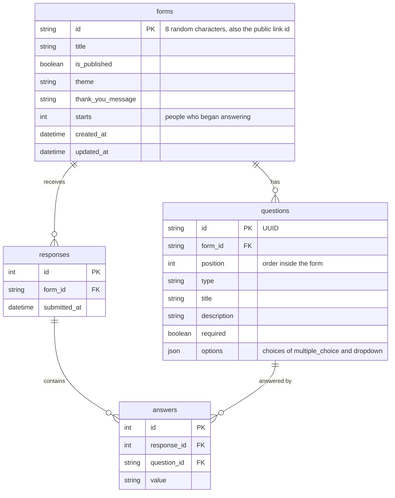

# Typeform Clone

A form builder modelled on Typeform. A creator builds a form in a drag-and-drop builder,
publishes it to get a shareable link, respondents fill it in one question at a time, and
the creator reads the results.

- **Frontend:** Next.js 16 (App Router, TypeScript), Tailwind CSS 4
- **Backend:** Python, FastAPI, SQLAlchemy
- **Database:** SQLite

## Features

| Area | What works |
| --- | --- |
| Form builder | Add, edit, delete and drag-to-reorder questions. Eight question types: short text, long text, multiple choice, dropdown, email, number, yes/no, rating. Required toggle and description per question. The canvas shows the question as respondents will see it, and a Preview button runs the real form. Changes save automatically. |
| Form management | List of forms with status (draft / published), response count and completion rate. Create, rename, duplicate, delete. Publish / unpublish with a public link. |
| Respondent flow | One question per screen with slide transitions, progress bar, and a thank-you screen. Keyboard: `Enter` or `↓` to advance, `↑` to go back, `A` `B` `C` to pick a choice, `Y` `N` for yes/no, `1`-`5` for ratings. Validation in the browser and again on the server. No login. |
| Results | Summary per question (bar counts for choice questions, average for ratings and numbers, latest answers for text), a table of all responses, a full view of a single response, CSV export. |
| Bonus | Six themes, CSV export, completion rate (starts vs. submissions). |
| Placeholders | Logic jumps, integrations / webhooks, team invites, file upload and payment questions are shown as "coming soon". |

## Running it locally

You need Python 3.11+ and Node.js 20.9+.

**1. Backend** (http://localhost:8000, interactive API docs at `/docs`)

```bash
cd backend
python -m venv .venv
.venv\Scripts\activate          # macOS / Linux: source .venv/bin/activate
pip install -r requirements.txt
uvicorn main:app --reload
```

On first start the backend creates `backend/typeform.db` and fills it with sample data:
two published forms with responses and one draft. Delete the file to start over.

**2. Frontend** (http://localhost:3000)

```bash
cd frontend
npm install
npm run dev
```

The frontend calls the API at `http://localhost:8000`. To point it somewhere else, set
`NEXT_PUBLIC_API_URL`.

## Project structure

```
backend/
  main.py          All API routes
  models.py        The four database tables (SQLAlchemy)
  schemas.py       Request and response shapes (Pydantic)
  validation.py    Server-side rules for one answer
  database.py      SQLite connection and per-request session
  seed.py          Sample forms and responses

frontend/
  app/
    page.tsx                      Dashboard: list of forms
    form/[id]/create/page.tsx     Builder
    form/[id]/results/page.tsx    Results
    to/[id]/page.tsx              Public form (what respondents open)
    layout.tsx, globals.css       Font, toasts, shared styles and animations
  components/
    FormPlayer.tsx                The one-question-at-a-time experience
    QuestionInput.tsx             The answer input for each question type
    FormHeader.tsx                Top bar of builder and results (tabs, publish, share)
    Modal.tsx                     Reusable dialog
    builder/QuestionList.tsx      Left panel: question list, add, drag to reorder
    builder/Canvas.tsx            Centre panel: edit the question in place
    builder/SettingsPanel.tsx     Right panel: type, required, theme
  lib/
    api.ts                        Types and one function per API endpoint
    forms.ts                      Question types, themes, validation rules
```

## Architecture

```
Browser (Next.js)  ── JSON over HTTP ──>  FastAPI  ── SQLAlchemy ──>  SQLite file
```

The frontend and the backend are separate apps that only talk through the REST API.
Every page is a client component that fetches its data from the API, because every
screen is interactive.

**Builder.** The builder keeps the whole form (title, theme, questions in order) in one
React state object. The three panels receive that state and callbacks to change it. Every
change updates the screen immediately and restarts a 600 ms timer; when the timer fires
the whole form is sent with one `PUT`. The server updates the questions it already has,
inserts new ones, deletes missing ones, and stores each question's index as its position,
so reordering needs no extra endpoint.

**Respondent flow.** `FormPlayer` holds the current question index and the answers. Moving
on validates the current answer, plays a leave animation, then swaps the question, which
plays an enter animation. The same component powers the builder's preview, with saving
switched off.

**Validation.** `lib/forms.ts` and `backend/validation.py` contain the same rules. The
browser checks for instant feedback; the server checks again because a browser can be
bypassed. If the server rejects a submission it returns `{question id: message}` and the
form jumps to that question.

## Database schema



- A **response** is one person submitting a form. An **answer** is one question's value
  inside that response, so a response with six questions has up to six answer rows.
- `answers` has a unique constraint on `(response_id, question_id)`: one answer per
  question per response.
- Every foreign key is indexed and uses `ON DELETE CASCADE`, so deleting a form removes its
  questions, responses and answers. SQLite only enforces foreign keys when
  `PRAGMA foreign_keys = ON` is set, which `database.py` does for every connection.
- Answers are stored as text whatever the question type (`"Asha"`, `"42"`, `"Yes"`, `"4"`).
  One row per answer lets the stats endpoint count values with a single
  `GROUP BY question_id, value` query.
- Unanswered optional questions have no row at all.

## API

Creator endpoints:

| Method | Path | Purpose |
| --- | --- | --- |
| GET | `/api/forms` | List forms with response count and completion rate |
| POST | `/api/forms` | Create a form |
| GET | `/api/forms/{id}` | One form with its questions |
| PUT | `/api/forms/{id}` | Save the whole form from the builder (title, theme, thank-you text, questions) |
| PATCH | `/api/forms/{id}` | Rename, publish or unpublish |
| DELETE | `/api/forms/{id}` | Delete a form and everything in it |
| POST | `/api/forms/{id}/duplicate` | Copy a form and its questions as a new draft |
| GET | `/api/forms/{id}/responses` | All responses, newest first |
| GET | `/api/forms/{id}/stats` | Starts, responses, completion rate, per-question counts and averages |
| GET | `/api/forms/{id}/responses.csv` | Responses as a CSV download |

Public endpoints (no login, published forms only, drafts return 404):

| Method | Path | Purpose |
| --- | --- | --- |
| GET | `/api/public/forms/{id}` | The form a respondent fills in |
| POST | `/api/public/forms/{id}/start` | Count a start (sent with the respondent's first answer) |
| POST | `/api/public/forms/{id}/responses` | Submit answers; `422` with `{question id: message}` if invalid |

## Design decisions

- **Whole-form save instead of an endpoint per question.** A form is edited as one
  document, so one `PUT` keeps the frontend to a single state object and makes each save
  all-or-nothing.
- **Question ids are UUIDs generated in the browser.** A new question can be shown and
  edited immediately, and autosave never has to wait for the server to hand back an id.
- **Form ids are short random strings, not 1, 2, 3.** The id appears in the public link,
  so it should not be guessable.
- **Choices are a JSON list on the question row.** They are always read and written
  together with their question, so a separate table would add a join and no benefit.
- **No drag-and-drop or animation library.** Reordering uses the browser's drag events and
  transitions are four CSS keyframes, which keeps the code short and readable.
- **Themes are CSS variables.** A container sets five colour variables from the chosen
  theme and every element inside reads them through Tailwind classes.

## Assumptions

- There is one creator and no login, as the brief allows. Adding accounts would mean a
  `users` table and an `owner_id` column on `forms`.
- Edits to a published form go live as soon as they save. There is no separate draft
  version of a published form.
- Multiple choice is single-select and ratings are always out of five.
- Deleting a question also deletes the answers collected for it; the builder asks first.
- Times are stored in UTC and shown in the viewer's local time.

## Deployment

- **Backend** on Render: `render.yaml` describes the service (root directory `backend`,
  build command `pip install -r requirements.txt`, start command
  `uvicorn main:app --host 0.0.0.0 --port $PORT`). On Render choose New > Blueprint and
  pick this repository.
- **Frontend** on Vercel: import the repository, set the root directory to `frontend`, and
  set the environment variable `NEXT_PUBLIC_API_URL` to the backend's URL.

On Render's free plan the backend sleeps after 15 minutes without traffic, so the first
request after a pause can take up to a minute.

SQLite is a file on the server's disk. On hosts whose free tier has a temporary disk, the
file is lost when the service restarts and the app starts again from the sample data. Set
`DATABASE_PATH` to a file on a persistent disk to keep data across restarts.
